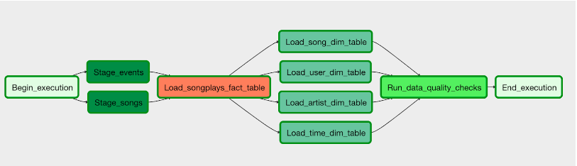

# Project: Data Pipeline with Airflow
## Summary of the Project
Sparkify is a startup which wants to analyze the data they've been collecting on songs and user activity on their new music streaming app. The analytics team is particularly interested in understanding what songs users are listening to.

In this project I use Apache Airflow to create a simple DAG to automate an ETL pipeline. The tasks are created to be reusable and data quality must be considered as well.

To complete the project, I create my own custom operators to perform tasks such as staging the data, filling the data warehouse, and running checks on the data as the final step.

# Datasets
The source data resides in S3 and needs to be processed in Sparkify's data warehouse in Amazon Redshift. The source datasets consist of JSON logs that tell about user activity in the application and JSON metadata about the songs the users listen to.

For this project, you'll be working with two datasets. Here are the s3 links for each:
- Log data: s3://udacity-dend/log_data
- Song data: s3://udacity-dend/song_data

# Files in the repository
The project template package contains three major components for the project:
- Dags solder: The dag file has all the imports and task dependencies and parameters
- Operators folder: The operators folder with custom operators
- Helpers folder: A helper class for the SQL transformations

# DAG configuration
In the DAG, add default parameters according to these guidelines
- The DAG does not have dependencies on past runs
- On failure, the task are retried 3 times
- Retries happen every 5 minutes
- Catchup is turned off
- Do not email on retry

